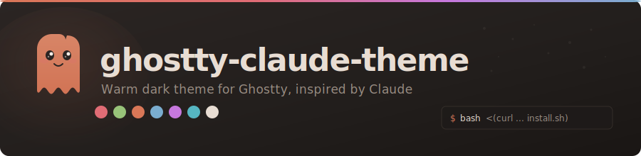
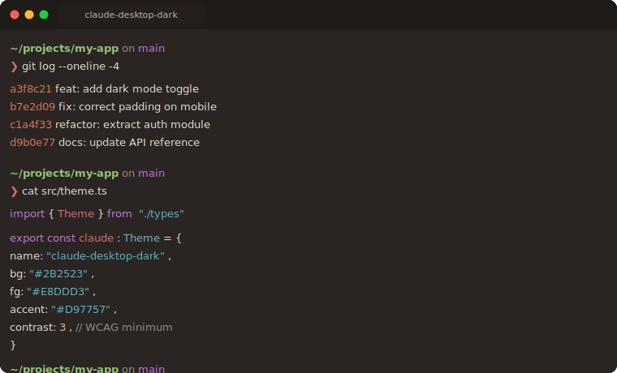
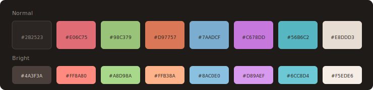

<p align="center">
  
</p>

<p align="center">
  <a href="LICENSE"></a>
  <a href="https://ghostty.org"></a>
  <a href="https://github.com/steavenpm/ghostty-claude-theme/pulls"></a>
</p>

<br>

<p align="center">
  
</p>

<br>

## Install

```bash
bash <(curl -fsSL https://raw.githubusercontent.com/steavenpm/ghostty-claude-theme/main/install.sh)
```

The installer gives you three options:

1. **Full config** -- theme + opinionated settings (backs up your existing config)
2. **Theme only** -- adds `theme = claude-desktop-dark` to your config
3. **Skip** -- just installs the theme file

> Reload Ghostty: **Cmd+Shift+,** or restart.

## What You Get

**Theme** -- warm dark brown background, cream text, terracotta orange cursor, and a full 16-color ANSI palette tuned for readability.

**Config** (optional) -- block cursor, font thickening, window padding, WCAG contrast enforcement, macOS tab-style titlebar, and other sensible defaults. See [`config/ghostty.conf`](config/ghostty.conf) for the full list.

<details>
<summary>Color palette</summary>

<br>

<p align="center">
  
</p>

</details>

<details>
<summary>Config settings</summary>

<br>

| Setting | Value | Why |
|---------|-------|-----|
| `cursor-style` | `block` | Visible on dark backgrounds |
| `cursor-style-blink` | `false` | Less distracting |
| `font-size` | `15` | Readable on Retina and non-Retina |
| `font-thicken` | `true` | Slightly bolder, easier to read |
| `adjust-cell-height` | `3` | More breathing room between lines |
| `window-padding-x/y` | `12` | Text doesn't touch window edges |
| `minimum-contrast` | `3` | Forces WCAG contrast ratio |
| `background-opacity` | `0.97` | Barely-there transparency |
| `macos-titlebar-style` | `tabs` | Tabs in the titlebar |
| `macos-option-as-alt` | `left` | Left Option works as Alt |

All options documented in the [Ghostty config reference](https://ghostty.org/docs/config/reference).

</details>

## Uninstall

```bash
rm ~/.config/ghostty/themes/claude-desktop-dark
```

Then remove `theme = claude-desktop-dark` from `~/.config/ghostty/config`.

If you used the full config install and want to restore your backup:

```bash
ls ~/.config/ghostty/config.backup.*   # find your backup
cp ~/.config/ghostty/config.backup.XXXXX ~/.config/ghostty/config
```

## Contributing

PRs welcome. See [CONTRIBUTING.md](CONTRIBUTING.md).

## License

[MIT](LICENSE)

---

<p align="center">
  <sub>Made by <a href="https://github.com/steavenpm">Steaven Rojas</a></sub>
</p>
